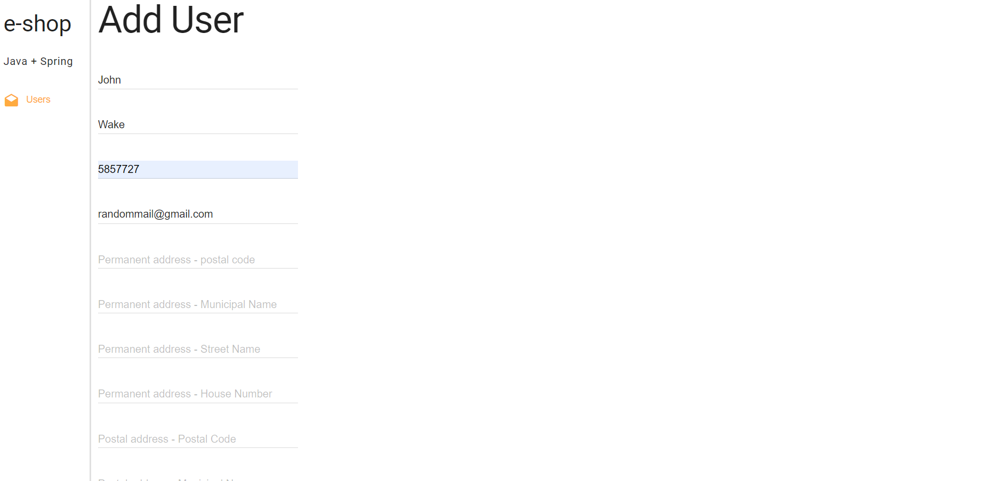
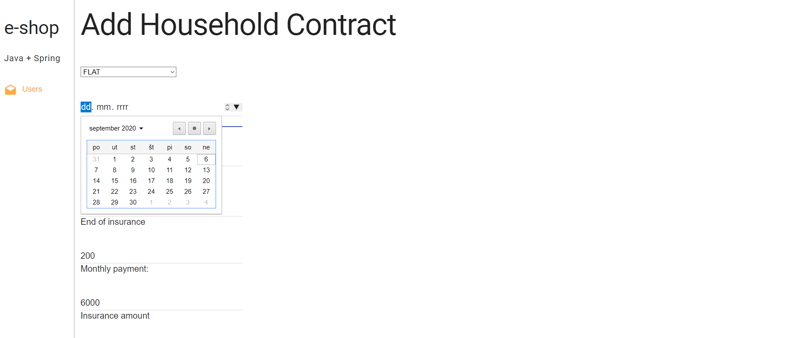
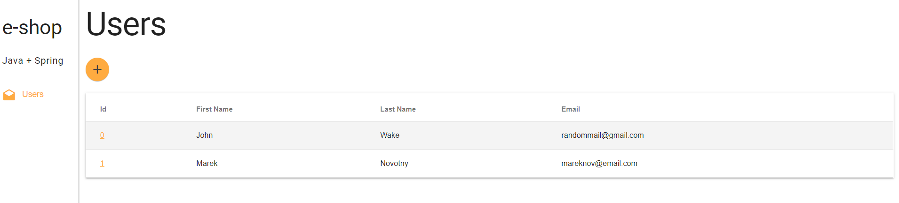

# CRUD Spring Boot Web App
Web app to create, read, update and delete users and their insurance forms. 

Made with Spring boot, Java, Thymeleaf (Java XML/XHTML/HTML5 template engine), HTML and CSS.

IDE: Intellij IDEA

Dependencies: Lombok, Spring boot

## Preview

**Adding a user to the database:**

**Adding a contract to the user:**

**Info about a specific user:**

**List of users in the database:**

